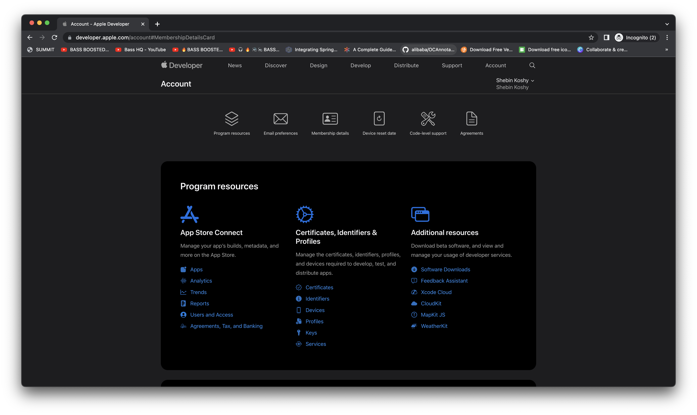

**AppStoreConnect procedure for iOS app release**
as per 2023 April 11

_App Store Connect:_
An Apple portal to manage artifacts/builds, AppStore distribution, TestFlight (beta test) distribution, Analytics, Trends, Payments and financial reports, etc

_Developer Certificate, Identifier & Profiles:_
An Apple portal to manage Developer certificates like APNs certificates, Provisioning profile, devices for adhoc distribution, APNs key, etc

**Prerequisites**
* Apple ID (email & password used to login to any apple’s portal)
* Ensure the targeted users of your app are public, otherwise you may lead to rejection from Apple’s app review team. For example, if your targeted users are employees of an organization, you have to go with Apple Developer Enterprise Program rather than Apple Developer Program.
Go through different type of memberships of Apple
https://developer.apple.com/support/compare-memberships/
https://developer.apple.com/custom-apps/
Ensure you get fee waivers or not
https://developer.apple.com/support/membership-fee-waiver/
* If your app is intended for AppStore distribution, you need Apple Developer Program membership. Check the eligibility by login into developer.apple.com

If you have relevant access, you will be able to see ‘Certificates, Identifiers & Profiles’ under the ‘Program resources’ section.
If you don’t have an eligible Apple Developer Program, please do the enrollment https://developer.apple.com/programs/enroll/ (payment will be there, 99 USD or 8,700 INR per year, you may need to add this amount to your Apple ID)
* If the client already has an organization type Apple Developer Program. Your Apple ID can be added as an admin user to get all the necessary access to do all the process. Client/AccountHolder can add you as an admin from “Users and Access” section in App Store Connect
* Xcode IDE or pipeline setup for uploading xcarchive file to App Store Connect

**Configure your app details in AppStoreConnect**
* Login to App Store Connect
* Click on “My Apps”

Click on “New App”

Fill the form

Platforms (Mandatory): Select at least one platform for your app. iPadOS and watchOS apps are considered part of the iOS platform.

Name (Mandatory, character limit 30, can edit later): The name of your app as it will appear on the App Store. This can't be longer than 30 characters.
Primary Language: If localized app information isn’t available in an App Store country or region, the information from your primary language will be used instead. Learn more

Bundle ID (Mandatory): The bundle ID must match the one you used in Xcode. It can't be changed after you upload your first build. If you couldn’t find the bundle ID register a new bundle ID by clicking the link

SKU (Mandatory, can edit later): A unique ID for your app that is not visible on the App Store.

‘1.0 Prepare for Submission’ section

Screenshots must be in the JPG or PNG format, and in the RGB color space. App previews must be in the M4V, MP4, or MOV format and can’t exceed 500 MB. Learn More

Screenshots dimensions for 6.7” display (mandatory): 1290x2796 (portrait) or 2796x1290 (landscape)

Screenshots dimensions for 6.5” display (can re-use 6.7” screenshots): 1242 x 2688 (portrait) or 2688 x 1242 (landscape), 1284 x 2778 (portrait), 2778 x 1284 (landscape)

Screenshots dimensions for 5.5” display (mandatory): 1242 x 2208 (portrait) or 2208 x 1242 (landscape)

Screenshots dimensions for iPad Pro (6th Gen) 12.9" display (only required if you support iPad screens): 2048 x 2732 (portrait) or 2732 x 2048 (landscape)

Screenshots dimensions for iPad Pro (2nd Gen) 12.9" display (can re-use iPad Pro (6th Gen) 12.9" display screenshot)

Promotional text (optional, character limit 170): 
Promotional text lets you inform your App Store visitors of any current app features without requiring an updated submission. This text will appear above your description on the App Store for customers with devices running iOS 11 or later, and macOS 10.13 or later.

Description (mandatory, character limit 4000):
A description of your app, detailing features and functionality.

Keywords (mandatory, character limit 100) : 
Include one or more keywords that describe your app. Keywords make App Store search results more accurate. Separate keywords with an English comma, Chinese comma, or a mix of both.

Support URL (mandatory):
A URL with support information for your app. This URL will be visible on the App Store.

Marketing URL (optional)
A URL with marketing information about your app. This URL will be visible on the App Store.

Version (mandatory):
The version number of the app you are adding. Numbering should follow software versioning conventions.

Copyright (mandatory):
The name of the person or entity that owns the exclusive rights to your app, preceded by the year the rights were obtained (for example, "2008 Acme Inc."). Do not provide a URL.

Routing App Coverage File (optional):
Specify the geographic regions supported by your app. The file must be in the .geojson format and can only contain one MultiPolygon element. Learn More

AppClip section (applicable only if you need to support AppClip for your app)
iMessage app section (applicable only if you support iMessage app)
Apple Watch section (applicable only if you support apple watch app)

Game Center (applicable only for games)

Sign-in information for Apple review team (applicable only if your app needs credential to access): This is a user name and password we can use to sign in to your app, so we can review all of its features. If users sign in using social media, provide information for an account we can use. Credentials must be valid and active for duration of review.
If it has 2 factor authentication like OTP, bypass it for Apple review team.

Contact Information (mandatory):
The person in your organization who should be contacted if the App Review team has any questions or needs additional information.
Notes for Apple review team (optional, character limit 4000):
Additional information about your app that can help during the review process. Include information that may be needed to test your app, such as app-specific settings.

Attachment for Apple review team (optional):
You can attach specific app documentation, demo videos, and other items to help prevent delays during the app review process. Make sure you use files with the following extensions: .pdf, .doc, .docx, .rtf, .pages, .xls, .xlsx, .numbers, .zip, .rar, .plist, .crash, .jpg, .png, .mp4, or .avi.

Release options

App Information section

Name (mandatory, character limit 15): 
The name will be reviewed before it is made available on the App Store.

Subtitle (optional, character limit 30): 
The subtitle will be reviewed before it is made available on the App Store.

Primary Category (Mandatory):

Secondary Category (Optional):

Content Rights (Mandatory):

Age Rating (Mandatory):
Learn More

Pricing and Availability section
u
Pricing (Mandatory)

Country or Region Availability (Mandatory)

Tax Category (Mandatory, already pre-filled as ‘App Store software’)

Pre-Orders (Optional)

App Privacy section

Privacy Policy URL (mandatory): 
A URL that links to your privacy policy. A privacy policy is required for all apps.

User Privacy Choices URL (optional):
A URL where users can modify and delete the data collected from the app, or decide how their data is used and shared.

Data collection practices (Mandatory):

TestFlight Section
Once the artifacts/Builds are uploaded to App Store Connect, it will appear under this section

Once the build is uploaded, if it's showing “Missing Compliance”, click on the yellow warning icon.

Once the build is ready in the TestFlight section, under “1.0 Prepare for Submission” -> Build, a button will appear to choose the build. 

Once it’s done, click on “Add for Review”, if there is any error on metadata, it will throw a detailed error. 
Submit for Review in the new window. And that’s it!!! Wait for the review team to respond. If you want to notice each state of the app in mobile, install AppStore Connect app in your device
Even after submitting, you might be able to change some fields.
Steps to upload an iOS app using Xcode IDE (Not recommended, recommended way is to automate the uploading process using pipeline or Xcode Cloud)

Ensure Version is matching with App Store Connect portal, Also ensure, there is no build exist with the same number in TestFlight section of App Store Connect portal.

Select the target device as “Any iOS Device”

Product -> Archive

Click on “Distribute App”

